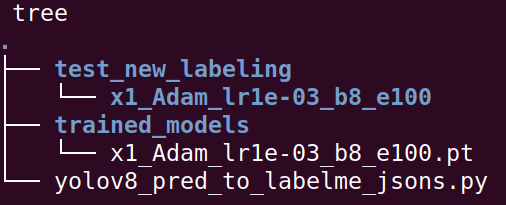
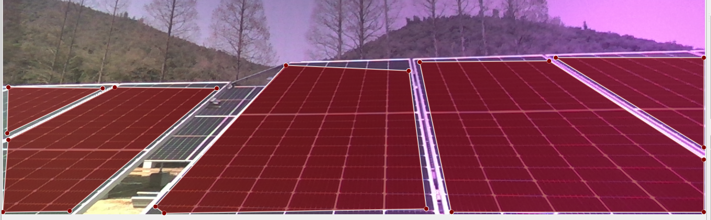
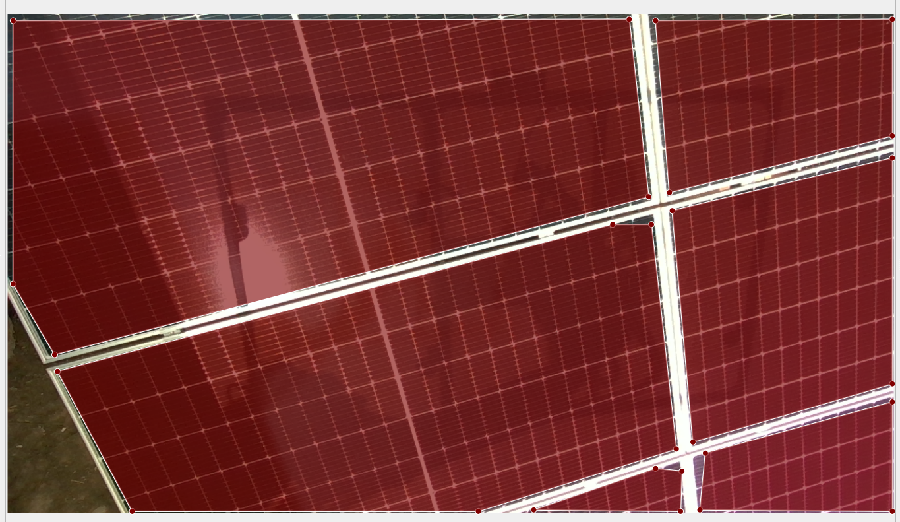
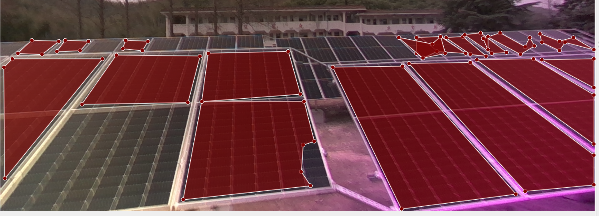

#### **测试说明 —— 用 YOLOv8  进行自动标注**

可以使用 YOLOv8 ，对图片进行自动标注。测试的 5 个步骤如下：

1. 在文件夹 demo 中，有 2 个子文件夹： trained_models  和 test_new_labeling，结构如下图。

   

2. 在 trained_models 文件夹中，放入训练好的模型 pt 文件。而在 test_new_labeling 文件夹中，创建一个同名文件夹，即上图的 x1_Adam_lr1e-03_b8_e100 文件夹。

3. 把要测试的图片，放入上图的 x1_Adam_lr1e-03_b8_e100 文件夹中。

4. 在终端中，进入 demo 文件夹，输入: python3 yolov8_pred_to_labelme_jsons.py  ，即可自动生成标注。

5. 在终端中打开 labelme ，然后用 labelme 打开上面的图片文件夹 x1_Adam_lr1e-03_b8_e100，即可看到自动生成的标注。

标注的效果如下：

a. 较好的情况。

b. 标注不好的情况。

从以上标注情况来看，后续可以从 2 个方面改进：

1. 持续使用更多数据进行训练，使得模型的预测结果更为准确。
2. 在生成标注时，优化模型的输出参数，以及生成标注的参数。

