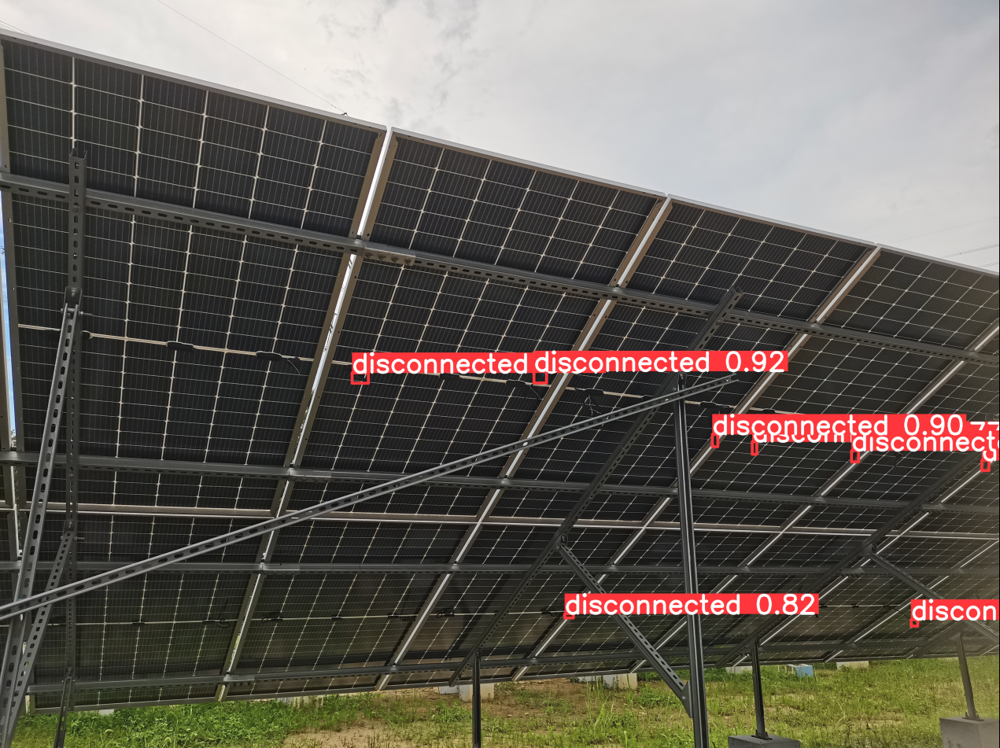

### **接插件检测项目 **

该项目主要检测光伏板的接插件是否正确连接。

### 2023-07-10 更新：

本周增加了 400 张光伏板图片，数千个接插件的标注，进行标注和训练之后，基本情况是：如果图片能够拍清楚，基本可以识别。如果图片看不清楚，识别也会比较困难。

对于变焦效果，用  4 楼的光伏板验证下来，使用 3x 和 5x 的效果较好，可以同时改进几个问题：接插件小，距离远，以及曝光太暗的问题。变焦后基本都可以看清接插件。

点测光有效果，不过看起来似乎没有变焦效果好。后续将根据需要，考虑是否再增加。

### 后续动作：

本周计划在巡检车上使用 3x 和 5x 放大的图片，也需要采集巡检车的图片并进行训练。（考虑手持巡检相机进行拍摄，然后训练并验证）

目前效果如下 3 图：

1. 图片中的接插件看不清楚时，识别有困难。

   

2. 变焦放大后，接插件看得比较清楚，也更容易识别。下图是 2P 光伏板使用 5 倍焦距的效果。

——————————————————————————————————————————————————

### 2023-06-16 更新：

目前使用了 800 多张光伏板接插件的图片，进行标注和训练之后，模型能够识别接插件的断开和连接两种情况。但是因为接插件很小，识别准确度不高。另外，远处的接插件也不容易识别到。

目前效果如下 3 图：

第 2 图。

第 3 图。

##### 

——————————————————————————————————————————————————

### 2023-06-13 更新：

目前使用了 600 张光伏板接插件的图片，进行标注和训练之后，模型能够初步对接插件进行检测。

##### 存在的问题：

因为目标接插件较小，当图片中的接插件拍得不清晰时，就难以进行判断。

接插件不清晰的主要原因有 3 个： 1. 光线不足，导致接插件拍得不清楚。2. 和接插件的距离大于 3m。3. 接插件为黑色，光伏板也是黑色。黑色物体在黑色背景下，难以看清楚。

1. 下图是一个因为光线不够，看不清楚的接插件。也有黑色背景的因素：

2. 距离在 3m 以上时，难以看清，如下图是一个模糊的接插件：

##### 后续动作：

1. 数据集中，给 2P 光伏板图片的数量，增加 300 张，尝试提高模型对暗光的适应性。
2. 考虑给巡检机器人增加照明，使得光伏板背部也能够比较明亮，从而提高探测准确性。可以进行实际验证。
3. 调参，寻找合适的优化器和 nbs 等参数，提高模型的准确度。

##### 当前模型的预测结果，如下 3 图：

第 1 图。

第 2 图。

第 3 图。

目前的检测条件：

1. 距离：最远 3m 左右。
2. 拍摄像素： 3648 x 2736

--------------------------------------------------------------------------------------------------------------------------------------

### 

