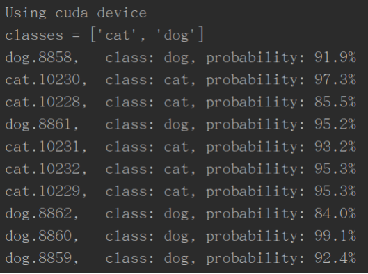

### **光伏板异物分类项目 **

#### 2023-05-17 更新：

目前已搭建 RegNet 模型并进行了修改，建立了数据集分割程序，学习率搜索等程序，初步实现了光伏板上的异物分类。

##### 已经使用的图片数量和尝试的异物类型如下：

##### 目前效果：

  

 

##### 后续动作：

1. 增加 tensorboard 程序，监测训练过程。
2. 增加数据增强程序，提高分类的准确度。
3. 增加其它形态的异物，并采集 2 块大光伏板的图片，训练模型。

#### 以下为 2023-05-09 更新内容：

该项目目标是识别光伏板上的异物，区分有异物和没有异物两种情况。

使用分类模型： RegNet 。

模型基础权重： RegNet_Y_16GF_Weights.IMAGENET1K_SWAG_E2E_V1

模型结构：

​	

目前已完成模型的初步搭建，在 Kaggle 的猫狗数据集上可以正常运行。下图为一个简单的运行情况。

后续动作：

1. 增加程序，实现 tensorboard 观测训练过程。
2. 增加程序，用图片显示模型推理结果。
3. 增加程序，使用 tqdm 显示模型训练过程。
4. 创建简单的光伏板异物数据集，从简单场景开始训练。
5. 完善程序，增加程序文档 docstrings。

