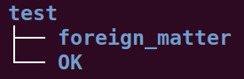
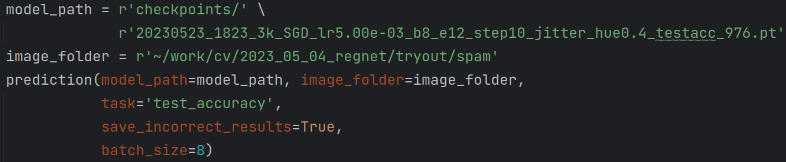

### **测试方法——光伏板异物分类 **


### 5 个步骤如下：

1. 在服务器上安装虚拟环境 torch2，终端运行：

   ```
   conda create -n torch2 python=3.10
   ```

   

2. 激活虚拟环境 torch2

   

   ```
   conda activate torch2
   ```

   

3. 把图片放入一个文件夹（假设该文件夹名为 spam），这个文件夹内应该包含一个 test 文件夹，文件夹结构如下图。把异物图片放入子文件夹，没有异物的图片放入 OK 文件夹。

   

4. 在 Pycharm 中打开文件 foreign_matter_classification.py ，在最底部的 if __name__ == '__main__': 部分，做 2 个设置：

   1. 把 image_folder 设置为 spam 的路径。

   2. 把 model_path 设置为模型的路径，模型后缀名为 .pt 。

      上面 2 个设置的示例如下图。

      

5. 运行 foreign_matter_classification.py ，即可测试准确度，并且会把错误的结果保存为图片。


——————————————————————————————————————————

