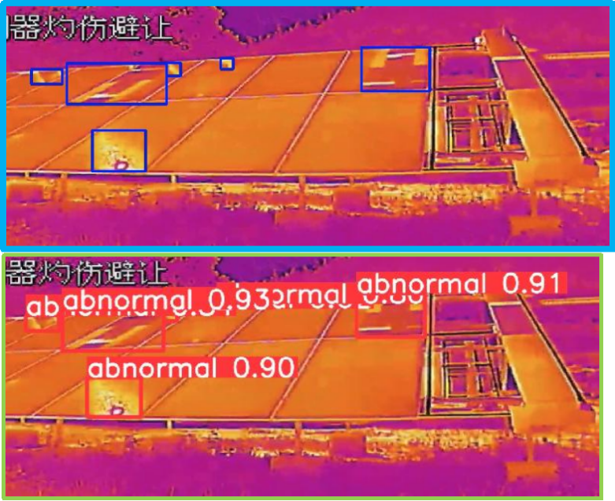
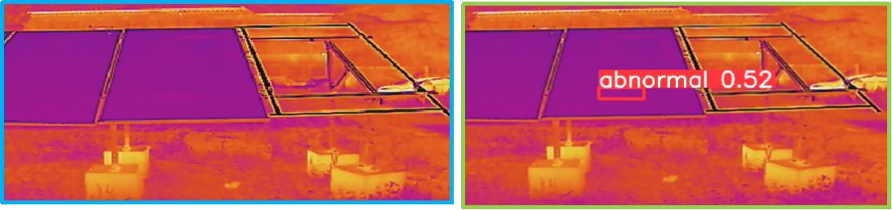

### **光伏板红外检测项目 **

#### 2023-06-06 更新：

目前使用了 120 张湖州现场的红外图片，进行标注和训练之后，模型能够初步对光伏板上的异常进行检测。

后续动作：

1. 增加数据集中图片的数量，提高模型的泛化能力。
2. 调参，寻找合适的优化器和 nbs 等参数，提高模型的 mAP 指标。

当前模型的预测结果，如下 2 图：

第 1 图对比，上半部分为标签，蓝色处有异常。下半部分为预测结果，和标签较为一致。

第 2 图对比，左边为标签，没有异常。右边为预测结果，预测了一个异常。 

!

--------------------------------------------------------------------------------------------------------------------------------------

### 2023-05-30 更新：

项目目标： 使用 YOLOv8 检测模型，对光伏板的红外图片进行检测，找出光伏板损坏等异常。

已实现的功能，以及增加的程序：

1. 创建了程序，对 labelme 的标注进行转换，从对角点的形式转换为 center_x, center_y, width, height 的形式。
2. 创建了程序，自动将图片和 txt 标签，一对一匹配，并且分配到训练集，验证集和测试集。
3. 创建程序，将学习率和优化器进行匹配，对初始的学习率进行搜索。
4. 使用现有的红外的图片，已把 YOLOv8 检测程序整体走通，可以对光伏板红外图片进行训练，检测。

下一步行动：

1.  查询 YOLOv8 检测的中间输出数据，在程序中将其输出。
2.  重构标签生成部分的代码。
3.  尝试各种超参组合，寻找光伏板检测的合适超参。
4.  收集我司的光伏板红外图片，进行标注，准备数据集。

