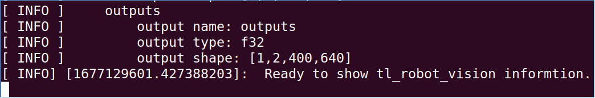
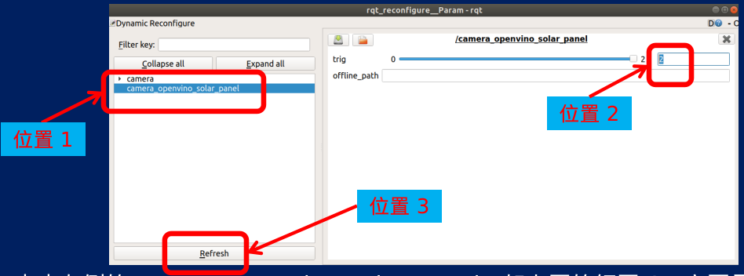
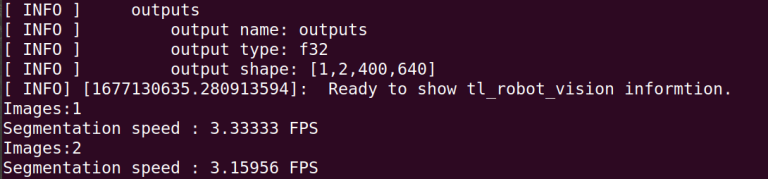

# 

**测试说明 —— 用 OpenVino 运行在线分割模型（法兰泰克）**

目前可以在法上，用 OpenVino 运行在线版的分割模型。测试的 6 个操作步骤如下：

1. 用 ToDesk 远程登录法兰泰克，进入模型的 deploly_openvino 文件夹，使用终端命令： cd ~/jun_ws/deploly_openvino
2. 启动 setup 文件，终端命令： source devel/setup.bash
3. 运行第 1 个 launch 文件，终端命令：   roslaunch test_realsense_camera.launch
4. 打开第 2 个终端，运行第 2 个 launch 文件，3 个命令如下：   
   按快捷键 ctrl + shift + t
   cd src/camera_openvino/launch
   roslaunch test_realsense_camera.launch
   此时页面输出一些内容后会暂停。如下图。

5. 调整动态参数， 5 个步骤如下建立第 3 个终端，按快捷键 ctrl + shift + t 。终端运行 rosrun rqt_reconfigure rqt_reconfigure ，会跳出一个新的窗口，如下图 。

6. 点击左侧的 camera_openvino_solar_panel，如上图的红圈 1。主要是测试的速率兰泰克车。在上图的红圈位置 2，输入一个数字 2 。点击红圈位置 3 的 refresh 按钮。回到刚才的第 2 个终端，就可以看到已经在进行分割，输出结果类似右图。

