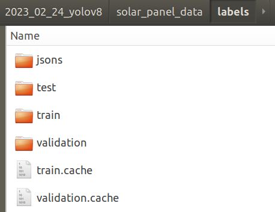
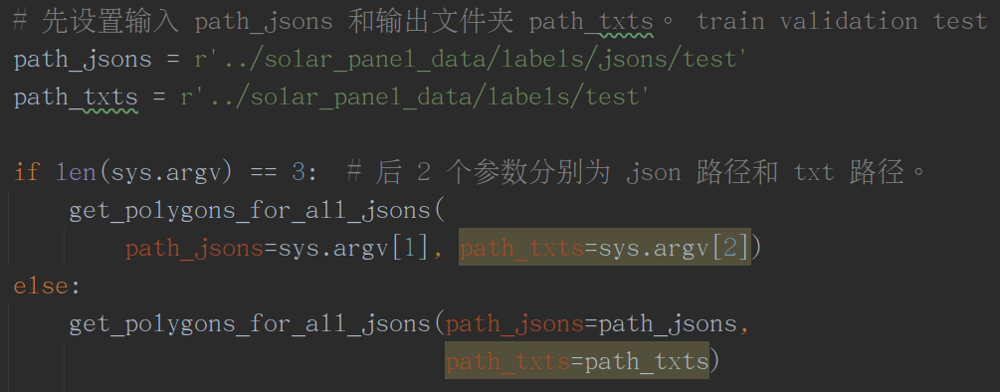
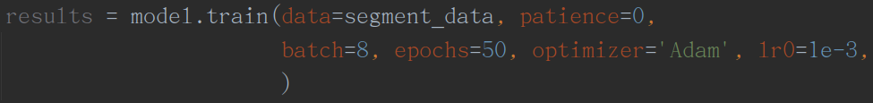
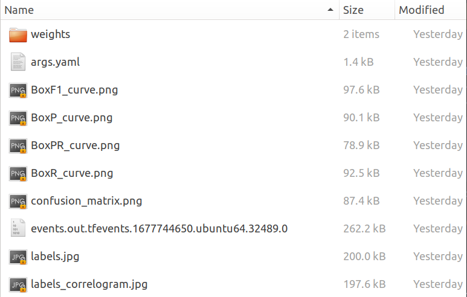

**使用说明 —— 用 YOLOv8  对光伏板进行实例分割 instance segmentation 训练**

使用 YOLOv8 对光伏板进行训练时，几个主要的步骤如下：

1. 设置好训练数据集文件夹，包括 train, validation, test。如下图。

   

2. 使用 json2txt_yolov8.py 文件，设置好 path_jsons 和 path_txts 这 2 个路径参数，然后运行文件。

   

3. 使用 segment_demo.py 文件，根据自己的需要，在 train 函数中，设置好训练参数，以及一些超参数，运行文件，即可开始训练。   

   

4. 训练结束后，在 Python 运行结果的底部，会提示数据文件夹的位置。在该文件夹中，可以查看训练的过程记录文件 。如下图示例。

   

如果是进行测试，在终端中使用如下命令，其中 source 是测试图片的路径。

yolo segment predict model=solar_all_data_seg_n_50.pt source="image" save conf=0.5
